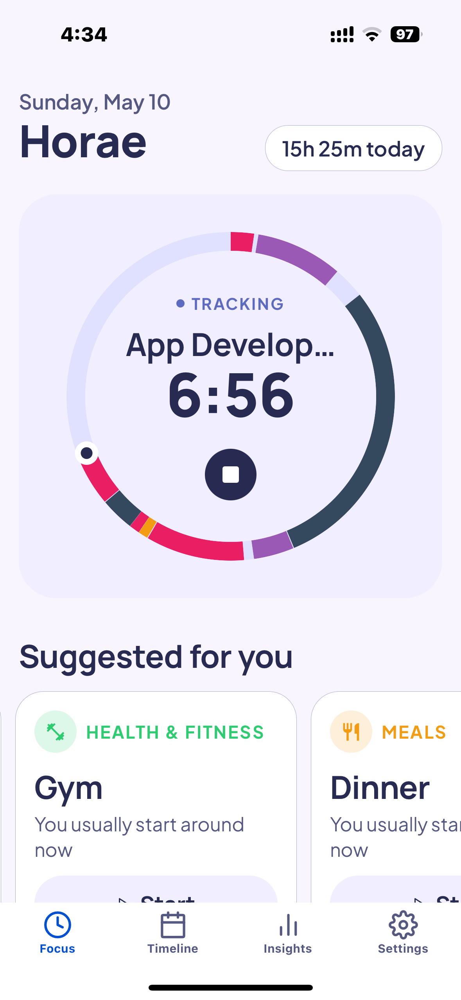

# Horae

**A mobile time-tracking app that helps you see how you actually spend your days — and how that lines up with how you want to.**

Named for the **Horae**, the Greek goddesses of the hours, who kept the rhythm of the day.

[**Download on the App Store**](https://apps.apple.com/app/horae/id6771047445) · [usehorae.com](https://usehorae.com)



---

## What it does

- **One-tap timer** — start tracking from a ring timer, a quick-start grid of your most-used activities, or a suggestion based on the time of day and your history.
- **Live Activity + Dynamic Island** — the running timer stays visible on the Lock Screen, with a native iOS home-screen widget mirroring it.
- **Timeline** — a scrollable day/week canvas of everything you tracked, with gap detection so you can backfill the hours you missed.
- **Insights** — donut breakdowns, day-of-week bars, a day-rhythm strip, a calendar heatmap, four-week trends, week-over-week deltas, and tracking-coverage stats.
- **Goals** — set ideal time allocations per category and see actual vs. ideal side by side.
- **Smart reminders** — local notifications for idle time and long-running timers, with quiet hours that defer rather than drop.
- **Offline-first, private by default** — everything lives on-device; there is no account required to use the app.
- **Local backup** — full JSON export/import with merge and replace modes.

## Stack

| Layer | Choice |
| --- | --- |
| App | React Native 0.83 + Expo SDK 55, TypeScript (strict), Expo Router |
| Local data | PowerSync + OP-SQLite (SQLite via JSI) |
| Cloud (Phase 3) | Supabase — Postgres, Auth, RLS, Edge Functions |
| Native | Swift — ActivityKit Live Activity + WidgetKit widget, exposed through a custom Expo native module |
| UI state | Zustand (ephemeral only — all persistent data goes through PowerSync) |
| Charts | `react-native-svg` (hand-built donuts, heatmaps, rhythm strips) |
| Notifications | `expo-notifications` (local scheduling only) |
| Monitoring | Sentry |
| Delivery | EAS Build → EAS Submit → TestFlight → App Store |
| Marketing site | Next.js 16 (App Router) + Tailwind v4 on Vercel |

## Technical details

The interesting problems in this codebase are mostly about **time**, **offline correctness**, and **what iOS will let you do while the app isn't running**.

**Timer state is derived, never accumulated.** A running timer is just a `time_entries` row with `ended_at = null`. Elapsed time is always recomputed as `now - started_at`, so it survives app kills, backgrounding, and clock changes. No `setInterval` ever adds to a counter.

**Timezone-correct aggregation.** All timestamps are stored as UTC ISO 8601, and each entry carries the IANA timezone it was created in so it can be displayed in its original zone. Day-boundary queries go through `getStartOfDay` / `getEndOfDay` helpers rather than naive `T00:00:00Z` strings, and every range aggregation *clips* durations to the range (`MIN(rangeEnd, ended) - MAX(rangeStart, started)`) so a session that spans midnight doesn't double-count across two days.

**Offline-first data layer.** Every write goes to local SQLite through PowerSync; cloud sync is additive rather than required. Tables are soft-deleted (`deleted_at`) and carry `updated_at` so the future sync layer can resolve conflicts. Screens never write raw SQL — all access goes through a typed query module (`db/queries/**`), and reactive reads use PowerSync's `useQuery` so the UI updates automatically on any mutation.

**Native iOS integration.** The Live Activity is a Swift ActivityKit widget (`targets/live-activity/`) driven by a hand-written Expo native module (`modules/live-activity/`), sharing state with the JS side through an App Group. The home-screen widget reads a snapshot the app writes on every timer transition.

**Notifications are reactive, not imperative.** A single root-level hook watches the running-entry query plus the user's notification preferences and reschedules OS-level notifications whenever either changes. Because JS can't run in the background, every nudge has to be scheduled ahead of time — making the scheduler a pure function of DB state means no mutation path can forget to update it.

**Type-level guarantees where SQLite has none.** `time_entries.source` is a TEXT column with no CHECK constraint, so it's enforced in code as a closed TypeScript union plus a `__DEV__` assertion at every write site — which lets read paths and analytics SQL trust a fixed alphabet.

**Theming.** Full light/dark support via a `useTheme()` / `useThemedStyles()` pattern that recomputes `StyleSheet` objects on scheme change, with a lint-by-convention rule that no component imports the static color table.

**Security posture for a public repo.** The repo is public, so the Supabase design doc specs RLS on every synced table scoped to `auth.uid()`, policies for all four operations, JWT re-validation inside Edge Functions, and a strict anon-key-vs-service-role split before any sync ships.

Deeper write-ups live in [`docs/`](./docs) — [`THEMING.md`](./docs/THEMING.md), [`BACKUP.md`](./docs/BACKUP.md), [`RELEASING.md`](./docs/RELEASING.md), and [`supabase/DESIGN.md`](./supabase/DESIGN.md).

## Getting Started

```bash
# Install dependencies
npm install

# Run on iOS simulator (required — PowerSync uses native SQLite via JSI, incompatible with Expo Go)
npx expo run:ios

# Type check
npx tsc --noEmit
```

## Project Layout

```
app/                # Expo Router screens (tabs, modals)
components/         # Reusable UI (timer, timeline, insights, common)
db/                 # PowerSync schema, models, queries, seed
hooks/              # useTimer, useElapsedTime, useInsightsData, etc.
lib/                # PowerSync init, timezone helpers, notifications, uuid
store/              # Zustand UI store
constants/          # Design tokens (theme.ts), preset categories
modules/            # Custom Expo native modules (Live Activity bridge)
targets/            # Swift widget / Live Activity extension
supabase/           # Migrations, seeds, Edge Functions (Phase 3)
landing/            # Next.js marketing site (usehorae.com)
docs/               # Architecture + release documentation
```

## Architecture Notes

- **Offline-first.** All writes go to local SQLite unless Cloud Sync is enabled
- **Timer state = a `time_entries` row with `ended_at = null`.** Elapsed time is always recomputed from `started_at` — never accumulated via `setInterval`.
- **All times stored in UTC** with the entry's IANA timezone alongside. Display in original timezone.
- **Soft deletes only** (`deleted_at`) to preserve sync integrity.
